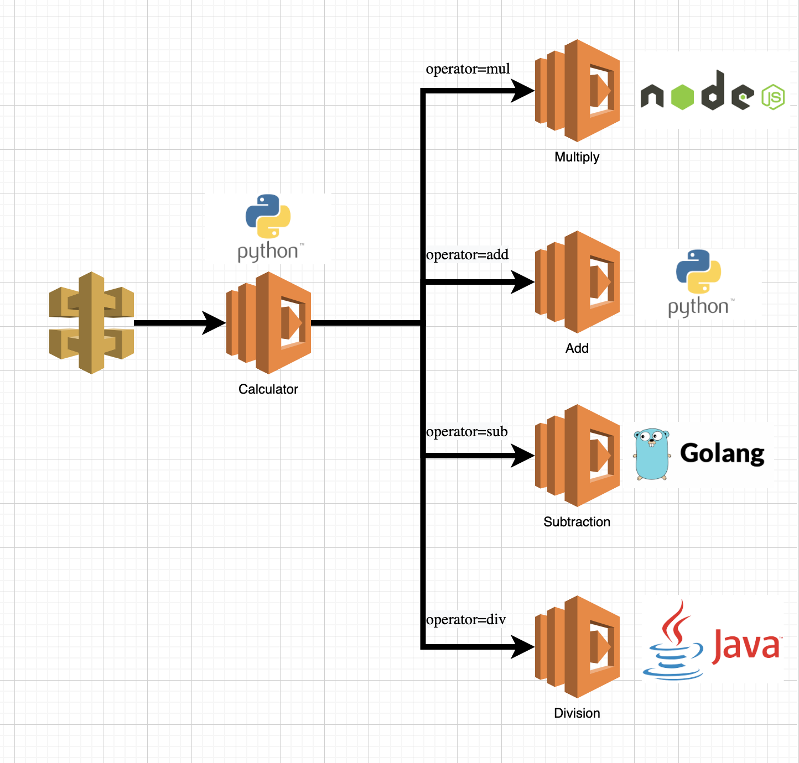

# Overview

This repository aims to achieve the following objectives

- Terraform stack environment to repeatedly spin up AWS Lambda funcions & API Gateway stack
- Splunk Lambda OTel Instrumentation for each the language in the Lambda function 
- How to Ote traces is propagated across different Lambda function that is invoked by another Lambda function

--- 

# Calculator Application

The application is a calculation that provides simple arithmetic operation mainly
- add   (python)
- sub   (golang)
- div   (java)
- mul   (nodejs)
 
Application will take in 3 parameters in the API URL (e.g. API_URL/?operand1=1&operand2=3&operator=add)
-  `operand1`   *integer*
-  `operand2`   *integer*
-  `operator`   *add* or *sub* or *div* or *mul*

---

# Pre-Requisite

Code has been developed and tested on

`Terraform v1.0.0`   
`aws-cli/2.3.5 Python/3.8.8 Darwin/21.3.0 exe/x86_64 prompt/off`
`go version go1.17.8 darwin/amd64`
`openjdk version "17.0.1" 2021-10-19`

AWS account must be setup with `aws configure`

--- 

# To Build 

Some of the Lambda functions will need to be built and uploaded for the following language
- Java
- Golang

User will need to separately invoke the following build steps to create the Java `jar` and Golang `exe` before running the `terraform apply` 

## To Build Java Division Function

`mvn clean package shade:shade`

### *Note*   
At the moment, our Java jar is created and stored inside the `/target` folder after the build. As a result, the Java jar will not be zipped to be uploaded for the `division` lambda function.    

Hence because of this, we hardcoded the the path of the jar directly inside the terrform file `variable.tf`

## To Build Go Subtraction Function

`env GOOS=linux GOARCH=amd64 go build -o subtraction subtraction.go`   

--- 

# To Deploy The Application

 `terraform init`

 `terraform plan`
 
 `terraform apply`
 
 `terraform destroy`

To run the lambda chain just use the following command and then check lambda logs for both the lambdas in cloudwatch

 `aws lambda invoke --function-name first_lambda out --log-type Tail`
 
 --- 

# To Run
 
Run the following commands to test the infrastructure.

` + git/lambda-invoking-lambda/bin + aws lambda invoke --function-name subtraction --cli-binary-format raw-in-base64-out  --payload '{ "operand1" : 100, "operand2" : 20, "operator" : "sub"}' output.txt` 

